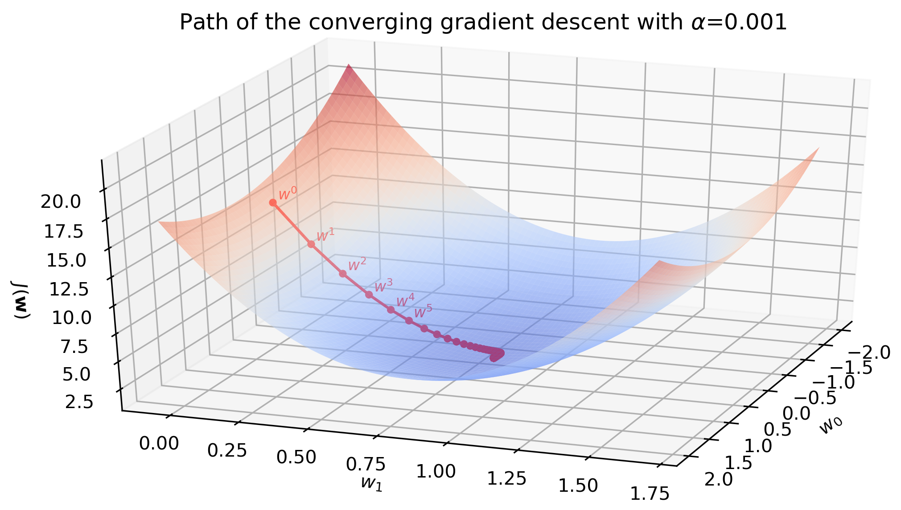
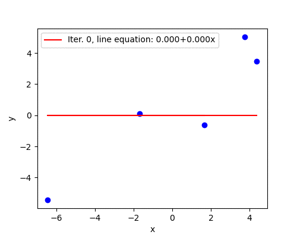
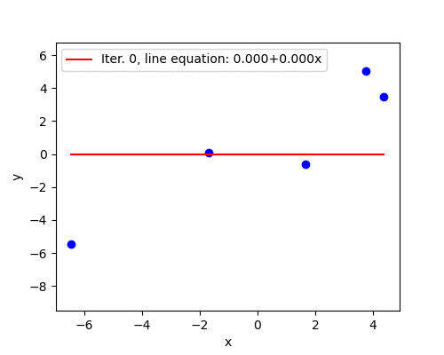
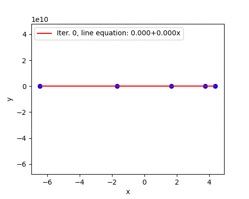

TODO: Match arguments and wording in the description of `sklearn.linear_model.LinearRegression`. [Source](https://scikit-learn.org/stable/modules/generated/sklearn.linear_model.LinearRegression.html)

TODO: Clean the references.

{width=100%}

We want to minimize a convex, continuous and differentiable cost function $J(\mathbf{w})$. In this blog post we discuss the most popular "hill-climbing" algorithm, **gradient descent**, using linear regression, and build it from scratch in Python. A few highlights:

* Code for linear regression and gradient descent is generalized to work with any first-order linear regression model, i.e., $y=w_0+w_1x_1+\dots+w_px_p$.
* Gradient descent is implemented using an object-oriented approach.
* Impact of the learning rate on convergence (divergence) is illustrated.

# Theoretical idea of the gradient descent

## Taylor expansion

Simplify the function you would like to minimize by using the first-order  Taylor polynomial. Provided that the norm $\lVert \mathbf{s} \rVert_2$ is small (i.e., $\mathbf{w}+\mathbf{s}$ is very close to $\mathbf{w}$), we can linearly approximate the function $J(\mathbf{w} + \mathbf{s})$ by its first derivative:

$$J(\mathbf{w}+\mathbf{s}) \approx J(\mathbf{w}) + \nabla J(\mathbf{w})^T \mathbf{s},$$

where $\nabla J(\mathbf{w})$ is the gradient of $J$. This approximation is valid only when the step size $\mathbf{s}$ is small and we will return to this in the learning rate discussion[^1].

The gradient vector 

$$
\nabla J(\mathbf{w})=\left[\begin{array}{c}
\dfrac{\partial J (\mathbf{w})}{\partial w_0}\\
\dfrac{\partial J (\mathbf{w})}{\partial w_1}\\
\vdots \\
\dfrac{\partial J (\mathbf{w})}{\partial w_p}
\end{array}\right]
$$

gives the direction of steepest ascent on the surface of the function $J$, and the rate of change in this direction is $\lVert \nabla J(\mathbf{w}) \rVert$. [^2]

TODO: Add a surface plot with 3 arrows: in the direction of $w_0$, $w_1$ and the gradient vector. E.g., [here](https://physics.stackexchange.com/questions/368634/direction-of-velocity-vector-in-3d-space)

## Convergence

Consequently, $-\nabla J(\mathbf{w})$ points in the direction of the steepest descent. Setting $\mathbf{s} = -\alpha \nabla J(\mathbf{w})$ for a *sufficiently small* $\alpha>0$ guarantees to decrease the function[^3]:

$\underset{after\ one\ update}{\underbrace{J(\mathbf{w} + (-\alpha \nabla J(\mathbf{w}))}} \approx J(\mathbf{w}) - \underset{>0}{\underbrace{\alpha\overset{>0}{\overbrace{ \nabla J(\mathbf{w})^T \nabla J(\mathbf{w})}}}} < \underset{before}{\underbrace{J(\mathbf{w})}}$

So the iterations of steepest descent are:

$$\mathbf{w}^{(i+1)} \leftarrow \mathbf{w}^{(i)} - \alpha \nabla J(\mathbf{w}^{(i)}).$$

## Algorithm

**Input:** Objective function $J(\mathbf{w})$, initial $\mathbf{w}^{(0)}$, learning rate $\alpha$, tolerance level $\epsilon$. \
**Result:** $\widehat{\mathbf{w}}$. 

1. Set $i \leftarrow 0$
2. **while** $\lVert \mathbf{w}^{(i)} - \mathbf{w}^{(i-1)} \rVert > \epsilon$  **do**
    3. Update $\mathbf{w}^{(i+1)} \leftarrow \mathbf{w}^{(i)} - \alpha \nabla J(\mathbf{w}^{(i)})$
    4. Update $i \leftarrow i + 1$
5. **end**
6. **return** $\widehat{\mathbf{w}} \leftarrow \mathbf{w}^{(i-1)}$

Adapted from [^4]

Now we need to define a function that we would like to minimize with the gradient descent. We will use linear regression with the squared loss.

# Linear regression

## Model

<!-- Regression amounts to learning the relationships between some input variables $\mathbf{x} = [x_1, \dots, x_p]^T$ and a numerical output variable $\mathbf{y}$. -->

The linear regression model assumes that the numerical output variable $y$ can be described as an affine combination of the $p$ input variables $x_1, \dots, x_p$ plus a noise term $\epsilon$,

$$y = w_0 + w_1x_1 + \dots + w_px_p + \epsilon.$$
The coefficients $\mathbf{w} = [w_0, \dots, w_p]^T$ are called parameters, weights or coefficients of the model.

Prepend $\mathbf{x}$ with a constant 1 to express the linear regression model compactly as 

$$y = \mathbf{w}^T \mathbf{x} + \epsilon.$$

The predicted output variable $\widehat{y}$ for some input variables $\mathbf{x}$ using learned parameters $\mathbf{\widehat{w}}$ is obtained with 

$$\widehat{y} = \mathbf{\widehat{w}}^T \mathbf{x}.$$
The parameters are learned by minimizing the cost function $J(\mathbf{w})$,

$$\widehat{\mathbf{w}} = \arg\min_\mathbf{w} J(\mathbf{w}).$$

We solve this optimization problem with the gradient descent.

## Cost function and its gradient

The cost function with the squared error loss is given by 

$$J(\mathbf{w}) = \frac{1}{n} \sum_{i=1}^{n}(\widehat{y_i} - y_i)^2,$$

where $n$ is the number of observations in the training data. It is a scalar-valued function. If $p=2$  then 

$$J(\mathbf{w}) = \frac{1}{n} \sum_{i=1}^{n}(w_0 + w_1 x_{1i} + x_2 x_{2i} - y_i)^2,$$

and the gradient using the chain rule of calculus is

$$\nabla J(\mathbf{w})=
\left[\begin{array}{c}
\dfrac{\partial J (\mathbf{w})}{\partial w_0}\\
\dfrac{\partial J (\mathbf{w})}{\partial w_1}\\
\dfrac{\partial J (\mathbf{w})}{\partial w_2} 
\end{array}\right]=
\left[\begin{array}{c}
2 \sum_{i=1}^{n}(w_0 + w_1 x_{1i} + x_2 x_{2i} - y_i) (-1)\\
\\
2 \sum_{i=1}^{n}(w_0 + w_1 x_{1i} + x_2 x_{2i} - y_i) (-x_{1i})\\
\\
2 \sum_{i=1}^{n}(w_0 + w_1 x_{1i} + x_2 x_{2i} - y_i) (-x_{2i})
\end{array}\right]$$

**Note:** When I first encountered the gradient descent, I could not understand how the gradient can be calculated from discrete data points. *"Derivatives require continuity, but I am given just a few data points"*, I thought. But this is a wrong way to think about the gradient. The gradient is calculated using the function (in our case, $J(\mathbf{w})$) and has nothing to do with the actual data at this stage. Notice how we calculated the gradient above and we did not care about the data points yet. Data points are used *to evaluate* the gradient at *a specific* point (in our case, at $\mathbf{w^{(i)}}$ in each iteration $i$ of the gradient descent algorithm).

# Implementation in Python

I chose an object-oriented approach because it keeps the environment clean and abstracts the unnecessary details away.

**`__init__` method**

Initial parameters `self.w` ($w^{(0)}$) are initialized as a zero vector. Initialization can be done arbitrarily here because we are dealing with a convex loss function. For convex problems there is only one stationary point, which also is the global minimum. 

**Note:** Sometimes we can save computation time by *warm-starting* the optimization procedure with a good initial guess. For example, iterations $2..k$ of a $k$-fold cross-validation may use parameters corresponding to a minimum loss in the previous iterations.

Other attributes are self-explanatory.

**`predict` method**

Calculates a one-dimensional array $\widehat{\mathbf{y}}$ using a vectorized dot product. $\mathbf{X}$ is an $n \times p$ data array. $\mathbf{w}$ is broadcasted to form a dot product with each row of $\mathbf{X}$

**`cost` method**

Calculates the value of the cost function using the current parameters. It is a scalar.

**`grad` method**

Calculates the gradient, a one-dimensional array.

`d_intercept` is a partial derivative of the cost function w.r.t. the intercept ($w_0$). It is a scalar.

`d_x` is a partial derivative of the cost function w.r.t. to input variables ($w_1, \dots, w_p$). It is vectorized, so its dimensions depend on the number of parameters in the linear regression model. It is a scalar if $p=1$ and a one-dimensional array otherwise.

**`fit` method**

Implements the gradient descent algorithm. Line 5 calculates the gradient and line 6 updates the parameters.

The value of parameters and cost at each iteration are saved in lines 7 and 9 for visualization purposes. 

The number of iterations is limited by `self.max_iterations`. An early stoppage in lines 12-13 occurs when the Euclidean norm of the difference between the gradient descent solution and least squares solution passes the tolerance level. Alternatively, we could use the last two values of the cost function - stop if a decrease is less than some tolerance level.

# Learning rate and convergence

*"Setting the learning rate $\alpha>0$ is a dark art. Only if it is sufficiently small will gradient descent converge"*[^5]. Below we take a look at how four different (tediously picked though trial and error) values of $\alpha$ impact the convergence and later we walk away from guessing.

Let's generate $\mathbf{X}$ and $\mathbf{y}$ data for the linear regression and use gradient descent to fit a straight line. Full code is available at my [GitHub repository](), so I omit the majority of details. Generated data looks as follows:

{width=70%}

We fit the line using the gradient descent as follows:

## Slow convergence

With learning rate $\alpha=0.001$ the algorithm slowly converges in 1001 iterations. The surface plot below is the surface of the cost function $J(\mathbf{w})$. Red dots are updated parameters from initial $\mathbf{w}^{(0)} = [0,0]$ to optimal $\mathbf{w}^{(1001)} = [0.24, 0.84]$.

{width=100%}

Animation below shows how the line is slowly fitted though iterations 1 to 30.

{width=70%}

## Good convergence

Learning rate $\alpha=0.005$ seems to be a better guess and the algorithm converges in 196 iterations. After the first three steps the parameters are fairly close to the optimal solution.

{width=100%}

The animation below illustrates the last statement - after the first three iterations the line barely moves.

{width=70%}

## Jumps

When the learning rate is large (but not too large yet), convergence happens in jumps. The change in $\mathbf{w}$ is large enough to take the updated parameters to the other side of the surface, surpassing the minimum point. With learning rate $\alpha=0.01$ the convergence shows this jumping behavior. Nevertheless, the algorithm converges because the magnitude of the gradient becomes smaller after each iteration. Convergence takes 95 iterations.

{width=100%}

Animation below illustrates the jumping behavior. With time, oscillations become smaller and eventually the algorithm converges.

{width=70%}

## Divergence

Learning rate $\alpha=0.02$ turns out to be too high. The magnitude of the gradient grows after the first iteration, which proportionally (because $\alpha$ is fixed) increases the step size for the next iteration. In this fashion, parameters $\mathbf{w}^{(i)}$ spiral away from the minimum very rapidly - compare the scale of $z$ axis on the previous plot and the one below with only four iterations.

{width=100%}

The fitted line does not seem to move during the first 20 iterations due to a huge scale of the plot (1e+10). However, later we see that the line starts to swing wildly and quickly approaches a vertical position where the cost becomes infinitely large.

{width=70%}

# Adaptive learning rate

A safe (but sometimes slow) choice is to set $\alpha = \frac{i_0}{i}$, where $i_0$ is any initial positive value and $i$ is the iteration counter. This guarantees that it will eventually become small enough to converge.[^6] Updates of $\alpha$ may be implemented with this line:

With the same generated data and $i_0=1$ the algorithm converged in 278,951 iterations (slow indeed).

## Adagrad

...

I would appreciate any comments or suggestions. Please leave them below, no login required if you check "I'd rather post as a guest".

Referenes:

[^1]: [Gradient Descent (and Beyond)](https://www.cs.cornell.edu/courses/cs4780/2018fa/lectures/lecturenote07.html)
[^2]: [Multivariate functions and partial derivatives. Section 3.2. The Gradient](https://people.math.umass.edu/~havens/Partials.pdf)
[^3]: [Gradient Descent (and Beyond)](https://www.cs.cornell.edu/courses/cs4780/2018fa/lectures/lecturenote07.html)
[^4]: [Supervised Machine Learning](http://smlbook.org/), Chapter 5 "Learning parametric models".
[^5]: [Gradient Descent (and Beyond)](https://www.cs.cornell.edu/courses/cs4780/2018fa/lectures/lecturenote07.html)
[^6]: [Gradient Descent (and Beyond)](https://www.cs.cornell.edu/courses/cs4780/2018fa/lectures/lecturenote07.html)
