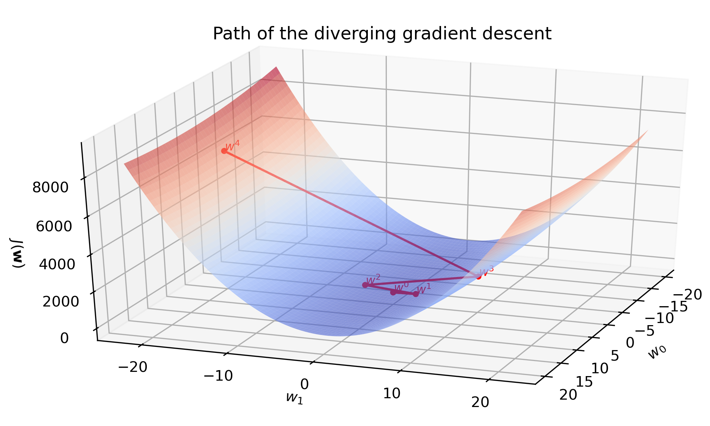
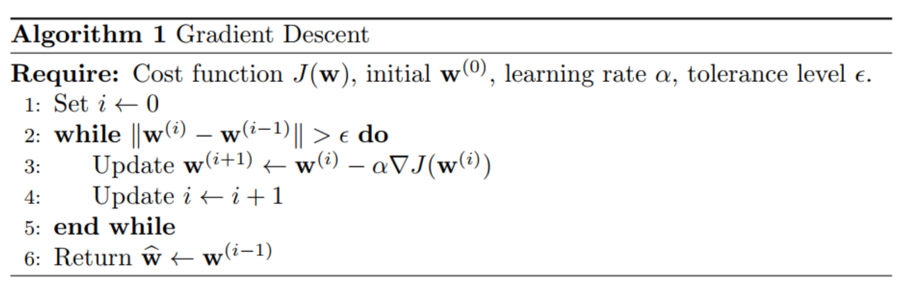
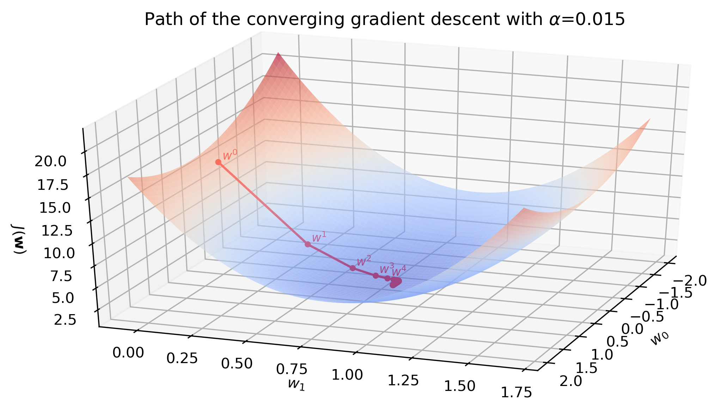
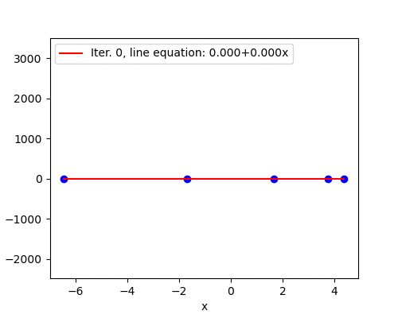

<!-- Hyper-parameters are parameters that are not directly learnt within estimators. In scikit-learn they are passed as arguments to the constructor of the estimator classes. -->

{width=100%}

We want to minimize a convex, continuous and differentiable cost function $J(\mathbf{w})$. In this blog post we discuss the most popular "hill-climbing" algorithm, **gradient descent**, using linear regression, and build it from scratch in Python. A few highlights:

* Code for linear regression and gradient descent is generalized to work with a model $y=w_0+w_1x_1+\dots+w_px_p$ for any $p$.
* Gradient descent is implemented using an object-oriented approach.
* Impact of the learning rate on convergence (divergence) is illustrated.

# Theoretical idea of the gradient descent

Throughout this post I use bold font for vectors (e.g., $\mathbf{w}$, $\mathbf{x}$) and regular font for scalars and functions (e.g., $w_0$, $x_0$).

## Taylor expansion

Simplify the function you would like to minimize by using the first-order Taylor polynomial. Provided that the norm $\lVert \mathbf{s} \rVert_2$ is small (i.e., $\mathbf{w}+\mathbf{s}$ is very close to $\mathbf{w}$), we can linearly approximate the function $J(\mathbf{w} + \mathbf{s})$ by its first derivative:

$$J(\mathbf{w}+\mathbf{s}) \approx J(\mathbf{w}) + \nabla J(\mathbf{w})^T \mathbf{s},$$

where $\nabla J(\mathbf{w})$ is the gradient of $J$. This approximation is valid only when the step size $\mathbf{s}$ is small. We will return to this in the learning rate discussion.

**Note:** We may also use the second-order Taylor polynomial to make a quadratic approximation of the function. Examples are Newton and Gauss-Newton methods. Second-order optimization methods consume more computation power and are less popular for machine learning model training.

## Gradient

The gradient vector 

$$
\nabla J(\mathbf{w})
= \frac{\partial J (\mathbf{w})}{\partial \mathbf{w}}
= \left[\begin{array}{c}
\dfrac{\partial J (\mathbf{w})}{\partial w_0}\\
\dfrac{\partial J (\mathbf{w})}{\partial w_1}\\
\vdots \\
\dfrac{\partial J (\mathbf{w})}{\partial w_p}
\end{array}\right] 
\in \mathbb{R}^{p+1 \times 1}
$$

gives the direction of steepest ascent on the surface of the function $J$, and the rate of change in this direction is $\lVert \nabla J(\mathbf{w}) \rVert$. [^partials]

<!-- 
 -->
<!-- TODO: Add a surface plot with 3 arrows: in the direction of $w_0$, $w_1$ and the gradient vector. E.g., [here](https://physics.stackexchange.com/questions/368634/direction-of-velocity-vector-in-3d-space) -->
<!-- 
 -->

## Convergence

Consequently, $-\nabla J(\mathbf{w})$ points in the direction of the steepest descent. Setting $\mathbf{s} = -\alpha \nabla J(\mathbf{w})$ for a *sufficiently small* $\alpha>0$ guarantees to decrease the function[^gradient-descent-and-beyond]:

$\underset{after\ one\ update}{\underbrace{J(\mathbf{w} + (-\alpha \nabla J(\mathbf{w}))}} \approx J(\mathbf{w}) - \underset{>0}{\underbrace{\alpha\overset{>0}{\overbrace{ \nabla J(\mathbf{w})^T \nabla J(\mathbf{w})}}}} < \underset{before}{\underbrace{J(\mathbf{w})}}$

So the iterations of steepest descent are:

$$\mathbf{w}^{(i+1)} \leftarrow \mathbf{w}^{(i)} - \alpha \nabla J(\mathbf{w}^{(i)}).$$

## Algorithm

<!-- https://www.overleaf.com/project/607b3c198b0e8e3c5fa3f21c -->

{width=100%}

<!-- 
 -->
<!-- Note: **do** ... **while** would be more suitable to avoid $\mathbf{w}^{(-1)}$. (2021-04-18) -->
<!-- 
 -->

We will implement this algorithm with linear regression using the squared loss. Let's now define the linear regression and optimization problems.

# Linear regression

## Model

The linear regression model assumes that the numerical output variable $y$ can be described as an affine combination of the $p$ features $x_1, \dots, x_p$ plus a noise term $\epsilon$,

$$y = w_0 + w_1x_1 + \dots + w_px_p + \epsilon.$$
The coefficients $\mathbf{w} = [w_0, w_1, \dots, w_p]^T$ are called parameters, weights or coefficients of the model.

Prepend a feature vector $\mathbf{x}$ with a constant 1

$$\mathbf{x} = [1, x_1, \dots, x_p]^T$$

to express the linear regression model compactly as 

$$y = \mathbf{w}^T \mathbf{x} + \epsilon.$$

The predicted output variable $\widehat{y}$ for some feature vector $\mathbf{x}$ using learned parameters $\mathbf{\widehat{w}}$ is obtained with 

$$\widehat{y} = \mathbf{\widehat{w}}^T \mathbf{x}.$$
The parameters are learned by minimizing the cost function $J(\mathbf{w})$,

$$\widehat{\mathbf{w}} = \arg\min_\mathbf{w} J(\mathbf{w}).$$

We solve this optimization problem with the gradient descent.

## Cost function and its gradient

The squared error loss 

$$L(y_i,\widehat{y_i}) = (y_i - \widehat{y_i})^2$$

is a common loss function used for measuring the closeness of a prediction and the training data. The cost function is the average of the loss function evaluated on the training data: 

$$J(\mathbf{w}) = \frac{1}{n} \sum_{i=1}^{n}(y_i - \widehat{y_i})^2,$$

where $n$ is the number of samples in the training data. It is a scalar-valued function. Quadratic nature of the loss function produces a [convex](https://en.wikipedia.org/wiki/Convex_function) cost function.

If $p=2$ then 

$$J(\mathbf{w}) = \frac{1}{n} \sum_{i=1}^{n}(y_i - (w_0 + w_1 x_{1i} + w_2 x_{2i}))^2,$$

and the gradient using the chain rule of calculus is

$$\nabla J(\mathbf{w})=
\left[\begin{array}{c}
\dfrac{\partial J (\mathbf{w})}{\partial w_0}\\
\dfrac{\partial J (\mathbf{w})}{\partial w_1}\\
\dfrac{\partial J (\mathbf{w})}{\partial w_2} 
\end{array}\right]=
\left[\begin{array}{c}
\frac{1}{n} 2 \sum_{i=1}^{n}(y_i - (w_0 + w_1 x_{1i} + w_2 x_{2i})) (-1)\\
\\
\frac{1}{n} 2 \sum_{i=1}^{n}(y_i - (w_0 + w_1 x_{1i} + w_2 x_{2i})) (-x_{1i})\\
\\
\frac{1}{n} 2 \sum_{i=1}^{n}(y_i - (w_0 + w_1 x_{1i} + w_2 x_{2i})) (-x_{2i})
\end{array}\right]$$

**Note:** When I first encountered the gradient descent, I could not understand how the gradient can be calculated from discrete data points. *"Derivatives require continuity, but I am given just a few data points"*, I thought. But this is a wrong way to think about the gradient. The gradient is calculated using a given function (in our case, $J(\mathbf{w})$) and has nothing to do with the actual data at this stage. Notice how we calculated the gradient above and we did not care about the data points yet. Data points are used *to evaluate* the gradient at *a specific* point (in our case, at $\mathbf{w^{(i)}}$ in each iteration $i$ of the gradient descent algorithm).

# Implementation in Python

### `grad`

Returns the gradient vector. `d_intercept` is a partial derivative of the cost function w.r.t. the intercept $w_0$. `d_x` is a partial derivative of the cost function w.r.t. to feature coefficients ($w_1, \dots, w_p$).

### `fit`

Line 63 initializes parameters $\mathbf{w^{(0)}}$ as a zero vector. Initialization can be done arbitrarily here because we are dealing with a convex loss function. For convex problems there is only one stationary point, which also is the global minimum.

**Note:** Sometimes we can save computation time by *warm-starting* the optimization procedure with a good initial guess. For example, iterations $2..k$ of a $k$-fold cross-validation may use parameters corresponding to a minimum loss in the previous iterations.

Lines 59-73 implement the gradient descent algorithm. Line 61 calculates the gradient, line 63 updates the parameters, line 66 calculates the value of the cost function. An early stoppage occurs when the Euclidean norm of the difference in parameters in the last two iterations becomes less than the tolerance level.

# Learning rate and convergence

"Setting the learning rate $\alpha>0$ is a dark art. Only if it is sufficiently small will gradient descent converge"[^ibid]. Below we take a look at how a choice of $\alpha$ impacts convergence.

Let's generate $\mathbf{X}$ and $\mathbf{y}$ data for the linear regression and use gradient descent to fit a straight line. Full code is available at my [GitHub repository](https://github.com/dmitrijsk/blogdown-dmitrijskass/tree/gradient-updates/content/post/2021-04-03-gradient-descent-with-linear-regression-from-scratch/code). Generated data looks as follows:

{width=80%}

We fit the line using the gradient descent with `GradientDescentLinearRegression().fit(X, y, "standard")`. The last argument defines a variant of gradient descent to use and `standard` means the standard gradient descent. We will be adding more methods in the following blog posts.

## Slow convergence

With learning rate $\alpha=0.001$ the algorithm slowly converges in 3058 iterations. The surface plot below is the surface of the cost function $J(\mathbf{w})$. Red dots are updated parameters from initial $\mathbf{w}^{(0)} = [0,0]$ to optimal $\mathbf{w}^{(3058)} = [0.24, 0.84]$.

{width=100%}

Animation below shows how the line is slowly fitted though iterations 0 to 49.

{width=80%}

## Good convergence

Learning rate $\alpha=0.015$ seems to be a better guess and the algorithm converges in 292 iterations. After the first five steps the parameters are fairly close to the optimal solution.

{width=100%}

The animation below illustrates the last statement - after the first five iterations the line barely moves.

{width=80%}

## Jumps

When the learning rate is large (but not too large yet), convergence happens in jumps. The change in $\mathbf{w}$ is large enough to take the updated parameters to the other side of the surface, surpassing the minimum point. With learning rate $\alpha=0.05$ the convergence shows this jumping behavior. Nevertheless, the algorithm converges because the magnitude of the gradient becomes smaller after each iteration. Convergence takes 97 iterations.

{width=100%}

This surface plot also reveals that the gradient descent algorithm does not really slide down the surface. In fact, it is a step-wise movement:

* Start at $[ w_0^{(0)}, w_1^{(0)},J(w_0^{(0)}, w_1^{(0)}) ]$, which is $[0, 0, 13.5]$.
* After the first update of the parameters, imagine the red dot moving in the $XY$ plane to $[ w_0^{(1)}, w_1^{(1)},J(w_0^{(0)}, w_1^{(0)}) ]$, which is $[-1.0, -27.3, 13.5]$.
* Then the cost is recalculated using $[ w_0^{(1)}, w_1^{(1)}]$ and the red dot descends to $[ w_0^{(1)}, w_1^{(1)},J(w_0^{(1)}, w_1^{(1)}) ]$, which is $[-1.0, -27.3, 6.3]$. But it is not guaranteed to descent. If the step size in $XY$ plane was too large, the red dot would actually ascend and the algorithm would diverge. 

Animation below illustrates the jumping behavior. With time, oscillations become smaller and eventually the algorithm converges.

{width=80%}

## Divergence

Learning rate $\alpha=0.08$ turns out to be too high. The magnitude of the gradient grows after the first iteration, which increases the step size for the next iteration. In this fashion, parameters $\mathbf{w}^{(i)}$ spiral away from the minimum very rapidly - compare the scale of $z$ axis on the previous plot and the one below with only seven iterations.

{width=100%}

The fitted line does not seem to move during the first few iterations due to a huge scale of the plot. However, later we see that the line starts to swing wildly and quickly approaches a vertical where the cost becomes infinitely large.

{width=80%}

 

We would like to get rid of the dark art of guessing learning rates. A safe (but sometimes slow) choice is to set $\alpha = \frac{i_0}{i}$, where $i_0$ is any initial positive value and $i$ is the iteration counter. This guarantees that it will eventually become small enough to converge[^ibid]. With the same generated data and $i_0=1$ the algorithm converged in 2384 iterations.

In the [next post](/2021/04/15/adagrad-adaptive-gradient-algorithm/) we will look at the adaptive gradient algorithm AdaGrad, which performs more informative gradient-based learning by adapting the learning rate for *each feature individually* and does not require guessing $\alpha$.

I would appreciate any comments or suggestions. Please leave them below, no login required if you check "I'd rather post as a guest".

[^partials]: Havens, A. Multivariate functions and partial derivatives. [Link](https://people.math.umass.edu/~havens/Partials.pdf)
[^gradient-descent-and-beyond]: "Gradient Descent (and Beyond)". Lecture notes for the "Machine Learning for Intelligent Systems" course by Kilian Weinberger at Cornell University. [Link](https://www.cs.cornell.edu/courses/cs4780/2018fa/lectures/lecturenote07.html)
[^ibid]: Ibid.
