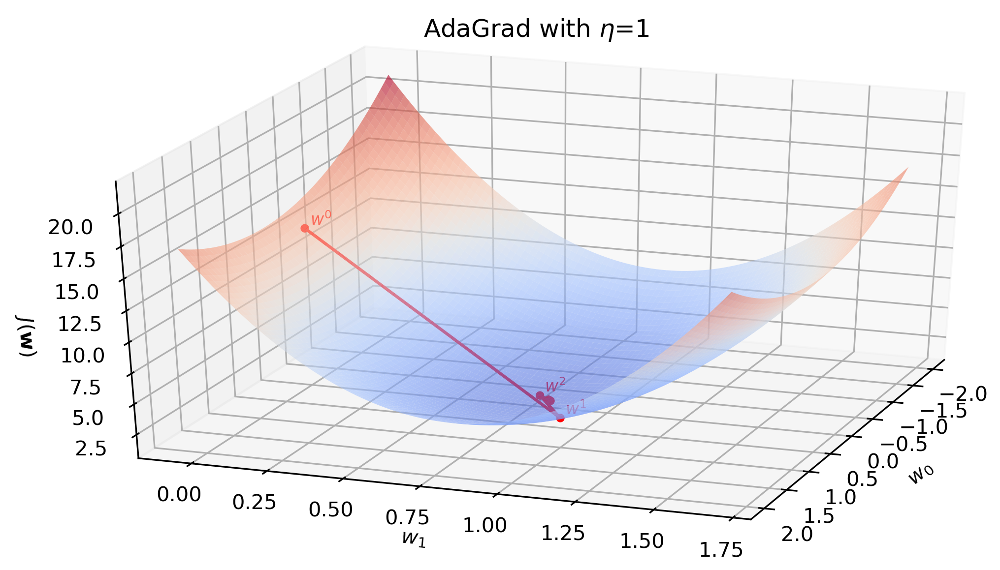
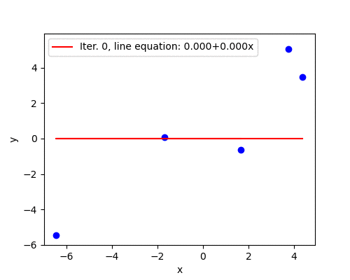

<!-- 
 -->
<!-- TODO: Add cover image with a surface and two paths with a few steps: by gradient descent and by AdaGrad. (2021-04-19) -->
<!-- 
 -->

We want to minimize a convex, continuous and differentiable cost function with gradient descent. One possible issue is a choice of a suitable learning rate. Another is a slow convergence in some dimensions because gradient descent treats all features as equal. But they are not![^stanford-lecture] AdaGrad[^adagrad] is one of the gradient-based optimization algorithms that aims to solve both of these issues.

AdaGrad adapts the learning rate individually to each model parameter. Setting different learning rates for different features is particularly important if they vary in frequency (e.g., common and rare words in word embeddings). Frequently occurring features receive very low learning rates (and small updates) and infrequent features high learning rates (and large updates). The intuition is that each time an infrequent feature is seen, the learner should "take notice". It does so by associating them with relatively larger learning rates during optimization. The same holds for features of different scale (e.g., milligrams and tons).

Throughout this post I use a bold font for vectors (e.g., $\mathbf{w}$, $\mathbf{x}$) and a regular font for scalars and functions (e.g., $w_0$, $J$).

# Theoretical idea of AdaGrad

At every iteration $i$, the learner receives the gradient vector $\mathbf{g}^{(i)}$. Standard gradient descent algorithm then multiplies it by the learning rate $\alpha$ and moves the model parameters in the opposite direction $-\alpha\mathbf{g}^{(i)}$. AdaGrad dynamically incorporates knowledge of the geometry of the data observed in earlier iterations to perform more informative gradient-based learning. The outer product matrix $\mathbf{G}^{(i)}$ keeps records of the computed historical gradients from the beginning until the current iteration:

$$\mathbf{G}^{(i)} = \sum_{t = 0}^{i} \mathbf{g}^{(t)} (\mathbf{g}^{(t)})^T.$$

The parameter update rule is 

$$\mathbf{w}^{(i)} \leftarrow \mathbf{w}^{(i-1)}-\eta\left(\mathbf{G}^{(i)}\right)^{-1/2} \mathbf{g}^{(i)},$$

where $\eta$ is an arbitrary positive constant. According to [Duchi et al.](https://www.jmlr.org/papers/volume12/duchi11a/duchi11a.pdf), the above algorithm is computationally impractical in high dimensions since it requires computation of the root of the full matrix $\mathbf{G}^{(i)}$. Therefore, the diagonal matrix $\text{diag}(\mathbf{G}^{(i)})$ is used instead. Both the inverse and root of it can be computed in linear time.

A small positive constant $\epsilon$ is added to the diagonal entries of $\text{diag}(\mathbf{G}^{(i)})$ to avoid division by zero. The update rule then becomes

$$\mathbf{w}^{(i)} \leftarrow \mathbf{w}^{(i-1)}-\eta\left(\text{diag}\left(\mathbf{G}^{(i)}\right) + \epsilon\cdot\mathbf{I}\right)^{-1/2} \mathbf{g}^{(i)}.$$

This is one way the update rule is often written, e.g., [here (page 13)](https://arxiv.org/pdf/1903.03614.pdf), [here (slide 83)](https://home.ttic.edu/~shubhendu/Pages/Files/Lecture6_pauses.pdf) and [here](https://ruder.io/optimizing-gradient-descent/index.html#adagrad). In practice, e.g., [here](https://cs231n.github.io/neural-networks-3/#ada), [here](https://www.cs.cornell.edu/courses/cs4780/2018fa/lectures/lecturenote07.html) and [here](http://d2l.ai/chapter_optimization/adagrad.html#the-algorithm), a mathematically equivalent form is used:

$$\mathbf{G}^{(i)} = \sum_{t = 0}^{i} \mathbf{g}^{(i)} \cdot \mathbf{g}^{(i)},$$

where $\mathbf{G}^{(i)}$ is a vector of the same length as $\mathbf{g}^{(i)}$ and gradient is squared element-wise. Then the update rule is 

$$\mathbf{w}^{(i)} \leftarrow \mathbf{w}^{(i-1)}-\frac{\eta}{\sqrt{\mathbf{G}^{(i)} + \epsilon}} \cdot \mathbf{g}^{(i)},$$

where the learning rate and the gradient are multiplied element-wise. This mathematical transformation is nicely shown [here](https://medium.com/konvergen/an-introduction-to-adagrad-f130ae871827). In essence, the learning rate in AdaGrad keeps a running average of the squared gradient magnitude.

If the elements of $\mathbf{G}^{(i)}$ are different then the learning rate for each feature will also be different. In addition, since $\mathbf{G}^{(i)}$ will be updated in each iteration, the learning rate for the same feature in different iterations will be different as well, which is the reason why the algorithm is called the adaptive gradient method.

# Algorithm

<!-- https://www.overleaf.com/project/607b3c198b0e8e3c5fa3f21c -->

{width=100%}

<!-- 
 -->
<!-- Note: **do** ... **while** would be more suitable to avoid $\mathbf{w}^{(-1)}$. (2021-04-18) -->
<!-- 
 -->

# Implementation in Python

Full code is available at my [GitHub repository](https://github.com/dmitrijsk/blogdown-dmitrijskass/tree/gradient-updates/content/post/2021-04-03-gradient-descent-with-linear-regression-from-scratch/code). Only a few changes need to be implemented in the gradient descent code with linear regression from [the previous post](/2021/04/03/gradient-descent-with-linear-regression-from-scratch/). $\mathbf{G}^{(0)}$ is initialized as a zero vector in line 70 and updated in line 42. The step size is calculated in line 43. $\eta$ is usually set at 0.01[^ruder] and $\epsilon$ is a small number, e.g., 1e-6.

# Convergence

To test convergence we use a toy dataset from [the previous post](/2021/04/03/gradient-descent-with-linear-regression-from-scratch/):

{width=80%}

With $\eta=0.01$ and $\epsilon=1e-6$ the algorithm converges in 10,579 iterations. However, the beauty of AdaGrad is that it eliminates the need to manually tune the learning rate. With $\eta=1$ it converges in 11 iterations (illustrated below) and with an extremely high $\eta=10$ is still converges in 12 iterations.

{width=100%}

Animation below show all 11 iterations AdaGrad needs to converge on the toy dataset with $\eta=1$.

{width=80%}

The weakness of AdaGrad is an aggressive monotonic growth of the denominator as squared gradients get accumulated. After a certain number of iterations the learning rate becomes infinitesimally small, at which point the algorithm essentially stops making steps in the direction of the minimum. ADADELTA[^adadelta] is an extension of AdaGrad that seeks to reduce its aggressive, monotonically decreasing learning rate.

<!-- 
 -->
<!-- RMSProp? (2021-04-22) -->
<!-- 
 -->

<!-- 
 -->
<!-- TODO: Test of diabetes (or any other) dataset: OLs, standard gradient descent, AdaGrad. (2021-04-22) -->
<!-- 
 -->

I would appreciate any comments or suggestions. Please leave them below, no login required if you check "I'd rather post as a guest".

[^stanford-lecture]: Duchi, J., Hazan, E., & Singer, Y. Adaptive Subgradient Methods for Online Learning and Stochastic Optimization. *International Symposium on Mathematical Programming 2012*. Available at: https://web.stanford.edu/~jduchi/projects/DuchiHaSi12_ismp.pdf
[^adagrad]: Duchi, J., Hazan, E., & Singer, Y. (2011). Adaptive subgradient methods for online learning and stochastic optimization. *Journal of machine learning research, 12(7).* Available at: http://jmlr.org/papers/v12/duchi11a.html
[^ruder]: Ruder, S. (2016, January 19). An overview of gradient descent optimization algorithms. Sebastian Ruder blog.  Available at: https://ruder.io/optimizing-gradient-descent/index.html#adagrad
[^adadelta]: Zeiler, M. D. (2012). ADADELTA: an adaptive learning rate method. *arXiv preprint arXiv:1212.5701.* Available at: https://arxiv.org/abs/1212.5701

