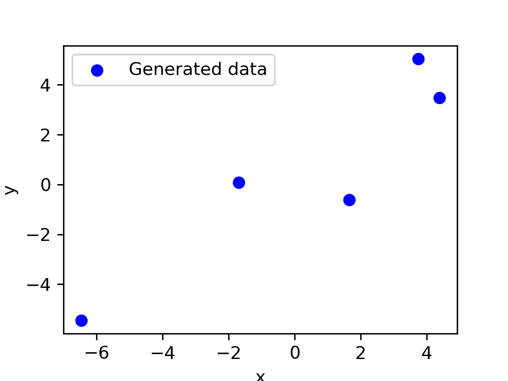

AdaGrad[^adagrad] is an algorithm for gradient-based optimization that adapts the learning rate individually to each parameter. Frequently occurring features receive very low learning rates (and small updates) and infrequent features high learning rates (and large updates). Setting different learning rates for different features is particularly important if they are of different scale or vary in frequency (e.g., common and rare words in text mining). The intuition is that each time an infrequent feature is seen, the learner should "take notice".

# Theoretical idea of AdaGrad

At every iteration $i$, the learner receives the gradient $\mathbf{g}^{(i)}$ vector. Standard gradient descent algorithm then multiplies it by the learning rate $\alpha$ and moves the model parameters in the opposite direction, i.e., $-\alpha\mathbf{g}^{(i)}$. AdaGrad dynamically incorporate knowledge of the geometry of the data observed in earlier iterations to perform more informative gradient-based learning. At every iteration it accumulates the squared gradients in $\mathbf{G}^{(i)}$:

$$\mathbf{G}^{(i+1)} \leftarrow \mathbf{G}^{(i)} + (\mathbf{g}^{(i)})^2.$$
We will call $\mathbf{G}^{(i)}$ cache. It has the same dimensions as the gradient. The parameter update rule is 

$$\mathbf{w}^{(i+1)} \leftarrow \mathbf{w}^{(i)}-\frac{\eta}{\sqrt{\mathbf{G}^{(i+1)} + \epsilon}} \mathbf{g}^{(i)},$$

where $\mathbf{w}$ are model parameters, $\eta$ is an arbitrary constant usually set at 0.01, $\mathbf{G}$ is cache and $\epsilon$ is a small number somewhere in range from 1e-4 to 1e-8, which avoid a division by zero. With this each parameter will get its own update.

# Algorithm

**Input:** Objective function $J(\mathbf{w})$, initial $\mathbf{w}^{(0)}$, initial $\mathbf{G}^{(0)}$, arbitrary constant $\eta$, a very small number $\epsilon$.\
**Result:** $\widehat{\mathbf{w}}$. 

1. Set $i \leftarrow 0$
2. **while** $\lVert \mathbf{w}^{(i)} - \mathbf{w}^{(i-1)} \rVert > \epsilon$  **do**
    3. Update $\mathbf{G}^{(i+1)} \leftarrow \mathbf{G}^{(i)} + (\mathbf{g}^{(i)})^2$
    4. Update $\mathbf{w}^{(i+1)} \leftarrow \mathbf{w}^{(i)}-\frac{\eta}{\sqrt{\mathbf{G}^{(i+1)} + \epsilon}} \mathbf{g}^{(i)}$
    4. Update $i \leftarrow i + 1$
5. **end**
6. **return** $\widehat{\mathbf{w}} \leftarrow \mathbf{w}^{(i-1)}$

**In the original article G is the diagonal matrix but it can beshown (e.g., https://medium.com/konvergen/an-introduction-to-adagrad-f130ae871827) that it is mathematically equivalent to the accumulation of the squared gradient.**

https://arxiv.org/pdf/1903.03614.pdf

https://arxiv.org/pdf/2011.12341.pdf

# Implementation in Python

Only a few changes need to be implemented in the gradient descent code with linear regression from [the previous post](/2021/04/03/gradient-descent-with-linear-regression-from-scratch/). We add the `adagrad` method and use in `fit`. Cache \mathbf{G} is initialized as a zero vector. 

# Convergence

To test convergence we use a toy dataset from [the previous post](/2021/04/03/gradient-descent-with-linear-regression-from-scratch/):

{width=70%}

Most implementations use $\eta=0.01$ by default[^ruder]. With such hyperparameter the algorithm converges in 20,218 iterations. However, the beauty of AdaGrad is that it eliminates the need to manually tune the learning rate. With $\eta=1$ it converges as well in 7 iterations (illustrated below) and with an extremely high $\eta=10$ is still converges in 10 iterations.

{width=100%}

Animation below show all 7 iterations AdaGrad needs to converge on the toy dataset with $\eta=1$.

{width=70%}

The weakness of AdaGrad is an aggressive monotonic growth of the denominator as squared gradients get accumulated. After a certain number of iterations the learning rate becomes infinitesimally small, at which point the algorithm essentially stops making steps in the direction of the minimum. ADADELTA[^adadelta] is an extension of AdaGrad that seeks to reduce its aggressive, monotonically decreasing learning rate.

I would appreciate any comments or suggestions. Please leave them below, no login required if you check "I'd rather post as a guest".

[^adagrad]: Duchi, J., Hazan, E., & Singer, Y. (2011). Adaptive Subgradient Methods for Online Learning and Stochastic Optimization. Journal of Machine Learning Research, 12, 2121–2159. Available at: http://jmlr.org/papers/v12/duchi11a.html
[^1]: [Gradient Descent (and Beyond)](https://www.cs.cornell.edu/courses/cs4780/2018fa/lectures/lecturenote07.html)
[^ruder]: Sebastian Ruder An overview of gradient descent optimization algorithms  https://ruder.io/optimizing-gradient-descent/index.html#adagrad
[^adadelta]: Zeiler, M.D. (2012). ADADELTA: An Adaptive Learning Rate Method. Available at: http://arxiv.org/abs/1212.5701
