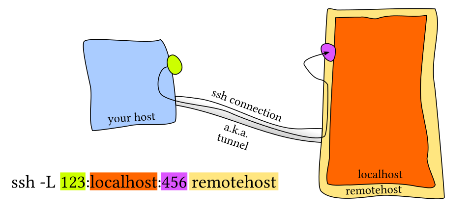
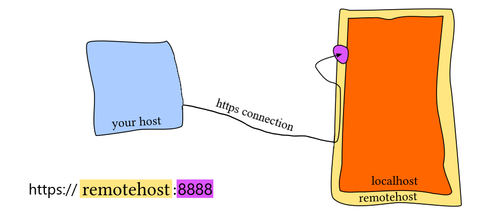

<center>
{width=25%}
</center>

We want to launch computationally expensive operations on a more powerful remote machine or a remote machine connected to a cluster. It can be a virtual machine on the cloud (e.g., AWS EC2) or a physical machine on a neighboring desk. The main thing is that you can access it using a remote IP. And we want to use a [Jupyter notebook](https://jupyter.org/) in a local browser to make coding and experimenting more pleasant. There are at least two ways to access Jupyter server that runs on a remote machine through a browser on a local machine:

1. Using SSH local port forwarding and `http://localhost:8888` in your browser.
2. Opening the 8888 port on a remote machine and using `https://<remote-ip>:8888`.

Both methods are explained step-by-step below. But first, a few installation steps.


# Install Jupyter Notebook{#inst}

```
pip3 install notebook
```

Notice messages about the PATH, e.g. 

```
WARNING: The scripts jupyter, jupyter-migrate and jupyter-troubleshoot are installed in '/home/ubuntu/.local/bin' which is not on PATH. 
Consider adding this directory to PATH or, if you prefer to suppress this warning, use --no-warn-script-location.
```

`jupyter` command will not work by default because it is not in the search PATH. We may use `/home/ubuntu/.local/bin/jupyter` (replace `ubuntu` with your user name) instead, but this is cumbersome. 

To add Jupyter directory to the user's search PATH *just for the current login session*:

```
export PATH=$PATH:~/.local/bin
```

If you want *to make this change permanent* then edit the user's `.bash_profile` file in the home directory:

1. Open the file for editing with `nano ~/.bash_profile`. This will create a file if it does not exist.
2. Add a line `PATH="$PATH:~/.local/bin"`. Save changes and close the file.
3. Source the file with `source ~/.bash_profile` for changes to take effect.

Additional reading:

* "PATH Definition" post about both options covered above. http://www.linfo.org/path_env_var.html


# Method 1: SSH port forwarding{#m1}

If you don't want to make your notebook accessible over the internet, you may use SSH local port forwarding to map the port 8888 on your local machine to the same port on the remote machine. This is illustrated in a beautiful sketch below from [this answer at unix.stackexchange.com](https://unix.stackexchange.com/questions/115897/whats-ssh-port-forwarding-and-whats-the-difference-between-ssh-local-and-remot/115906#115906):

<center>
{#id .class width=80% height=80%}
</center>

Basically, local port forwarding creates an encrypted SSH connection between a local and a remote machine and tunnels the traffic securely.


**Option 1: Command line interface**

The first option is to use a command from the sketch above. A few changes for our scenario:

* Replace both ports with 8888.
* Replace `remotehost` with something like `<user>@<remote-ip>` where a `<user>` is the one used to launch Jupyter on the remote machine.
* Add `-f` to send SSH to the background just before command execution.
* Add `-N` to prevent the execution of a remote command.
* Add `-i` followed by a path to the private key if you are using public key authentication.


Here is a command to run on a local machine:

```
ssh -N -f -L localhost:8888:localhost:8888 <user>@<remote-ip> -i <private-key>
```

Additional reading:

* "SSH port forwarding - Example, command, server config". Available at: https://www.ssh.com/academy/ssh/tunneling/example#local-forwarding
* "How to Set up SSH Tunneling (Port Forwarding)". Available at: https://linuxize.com/post/how-to-setup-ssh-tunneling/


**Option 2: Edit `~/.ssh/config`**

The second option is to edit `~/.ssh/config` on your local machine. For me it creates a more transparent picture of port forwarding. Open `config` for editing. I use [Nano](https://linuxize.com/post/how-to-use-nano-text-editor/):

```
nano ~/.ssh/config
```

Add the lines below, replace `<remote-ip>` and `<user>`.

```
Host <remote-ip>
  User <user>
  LocalForward 8888 localhost:8888
```

Save changes, reconnect to the remote machine.


**Run Jupyter**

Now that SSH local port forwarding is done, we may launch Jupyter on the remote machine without opening a web browser with 

```
jupyter notebook --no-browser
```

Open the browser on your local machine and go to `http://localhost:8888`. **Done.** This method does not require opening the 8888 port on the remote machine.


# Method 2: Secure connection through the internet{#m2}

### Insecure

An insecure method that you should avoid goes like this:

1. Open the 8888 port for the inbound connection on the remote machine.
2. Start Jupyter on the remote machine with `jupyter notebook --ip=* --no-browser`. The `--ip` option defines the IP address the notebook server will listen on. The default value is `localhost`. 
3. Access it through your local browser using the link from the terminal (something like `http://localhost:8888/?token=6a69e967c4d0e526b756f5bed36174df958fa9825a029c3a`). Replace `localhost` in this link with the public IP of the remote machine.

This should be avoided because connection to your notebook is open to the general public and it can be used to run any type of commands. 

Instead, consider a secure version.

### Secure

I tried modify a sketch above to represent a case of a secure connection over the internet:

<center>
{#id .class width=80% height=80%}
</center>


Steps below are based on the Jupyter Notebook documentation article ["Configuring the Notebook and Server"](https://testnb.readthedocs.io/en/stable/examples/Notebook/Configuring%20the%20Notebook%20and%20Server.html). Here is a short summary:

1. Create a config file `~/.jupyter/jupyter_notebook_config.py`:

    ```
    jupyter notebook --generate-config
    ```
    
2. Protect your notebook with a password. Prepare a hashed password in Python:

    ```
    python3
    >>>> from IPython.lib import passwd
    >>>> password = passwd("secret") # Replace "secret" with your passord
    >>>> password
    'sha1:3b6a76a30e8c:c7b277c67471730132f83cb45a95ab462495adfg'
   ```
   
   Open the config file for editing, find a line with `c.NotebookApp.password`, uncomment it and replace '' with your hashed password:
   
    ```
    ## Hashed password to use for web authentication.
    #
    #  To generate, type in a python/IPython shell:
    #
    #    from notebook.auth import passwd; passwd()
    #
    #  The string should be of the form type:salt:hashed-password.
    #  Default: ''
    c.NotebookApp.password = u'sha1:3b6a76a30e8c:c7b277c67471730132f83cb45a95ab462495adfg'
   ```

3. Use SSL, so that your password is not sent unencrypted by your browser to the web server. Generate an SSL certificate:
    
    ```
    cd ~/.jupyter
    openssl req -x509 -nodes -days 365 -newkey rsa:2048 -keyout mycert.key -out mycert.crt
    ```
    
    Add a certificate to the Jupyter config file:
    
    ```
    ## The full path to an SSL/TLS certificate file.
    #  Default: ''
    c.NotebookApp.certfile = u'/home/ubuntu/.jupyter/mycert.crt'
    
    ## The full path to a private key file for usage with SSL/TLS.
    #  Default: ''
    c.NotebookApp.keyfile = u'/home/ubuntu/.jupyter/mycert.key'
    ```

Open the browser on your local machine and go to `https://<remote-ip>:8888`. **Done.** Note that when you enable SSL support, you will need to access the notebook server over `https://`, rather than plain `http://`.

Additional reading:

* "Config file and command line options". Available at: https://jupyter-notebook.readthedocs.io/en/stable/config.html


# Useful tips{#tips}

### Run Jupyter in the background and close the terminal

We want to launch a lengthy computation in Jupyter on a remote machine and shut down our local machine. We also want to see all output in the terminal when we reconnect. One option is to use a terminal multiplexer, e.g., [tmux](https://github.com/tmux/tmux/wiki): 

```
sudo apt install tmux
tmux new -s jpt # jpt is an arbitrary session name
```

Additional reading:

* "How to Use tmux on Linux (and Why It's Better Than Screen)". Available at: https://www.howtogeek.com/671422/how-to-use-tmux-on-linux-and-why-its-better-than-screen/
* "How do I scroll in tmux". Available at: https://superuser.com/questions/209437/how-do-i-scroll-in-tmux


<!-- Alternatively, append `&` to the `jupyter notebook` command to run it in the background. The process ID will get printed in the terminal. You may now continue using the terminal. -->

### List and kill Jupyter sessions from the terminal

If port 8888 is busy then launching Jupyter again will serve it on port 8889, 8890 and so on. To find all Jupyter processes use

```
ps -adef | grep jupyter
```

The second column is a process ID (`<pid>`). To kill a process use 

```
kill -9 <pid>
```

<hr>

I would appreciate any comments or suggestions. Please leave them below, no login required if you check "I'd rather post as a guest".
