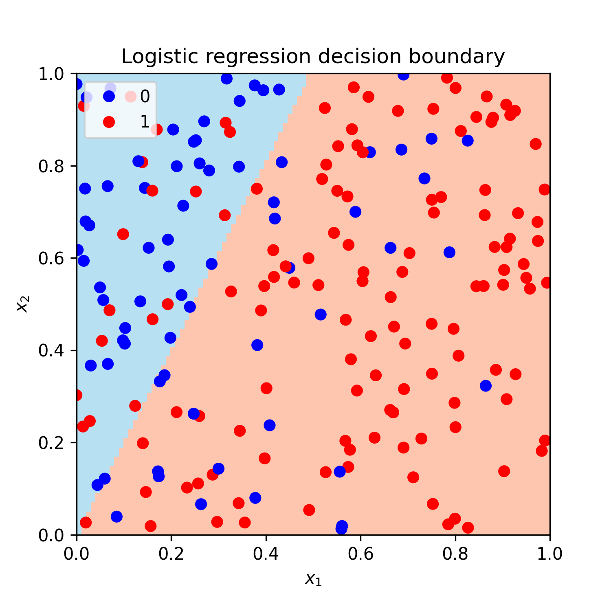

When using a linear regression, we asume that the data was generated by the $y_i=\boldsymbol\theta^\top \mathbf{x}_i+\epsilon$, where $\epsilon$ is an explicit noise term. Usually it is assumed to be Normally distributed. This is a source of randomness in the linear regression model and that's why data points don't lie on the straight line.

What is the source of randomness in a binary logistic regression model? Recall that logistic regression is a classification model where a conditional probability for the positive class (labeled as $1$) is

$$p(y = 1 | \mathbf{x}; \boldsymbol\theta) = \text{logistic}(\boldsymbol\theta^\top\mathbf{x}) = 1 / (1 + e^{-\boldsymbol\theta^\top\mathbf{x}}),$$

where $y$ is a class label, $\boldsymbol\theta$ is a vector of model parameters and $\mathbf{x}$ is a set of features. The dot product $\boldsymbol\theta^\top\mathbf{x}$ is usually referred to as a logit.

Notice that there is no explicit noise term here. The randomness in logistic regression setting originates from that fact that the class labels of data points follow Bernoulli distribution. Therefore, the probability of a data point being of a positive class is $\text{Bernoulli(logistic}(\boldsymbol\theta^\top\mathbf{x})\text{)}$.

To see this in practice, let's simulate a dataset for binary logistic regression using Python.

```{python eval=FALSE}
import numpy as np
from sklearn.linear_model import LogisticRegression
```

Define a logistic function to model a probability of a positive class.

```{python eval=FALSE}
def logistic(z):
    return 1 / (1 + np.exp(-z))
```

Define the true values for the parameter vector $\boldsymbol\theta$ of length $p$.

```{python eval=FALSE}
# True theta coefficients.
theta = np.array([4, -2])
# Number of features.
p = len(theta)
```

Generate $n$ data points from a uniform distribution on [0,1].

```{python eval=FALSE}
# Number of training data points.
n = 200
# Generate feature values from U[0,1].
np.random.seed(1)
X = np.random.rand(n, p)
```

Calculate the probabilities of the positive class (labeled as $1$).

```{python eval=FALSE}
# Calculate logits.
z = X @ theta.reshape(-1, 1)
# Calculate probabilities.
prob = logistic(z)
```

Generate class labels from Bernoulli. Each data point uses its own probability from `prob`.

```{python eval=FALSE}
# Generate labels by sampling from Bernoulli(prob)
y = np.random.binomial(1, prob.flatten())
```

Train a logistic regression model with no intercept and no regularization. By default, the penalty is $L_2$.

```{python eval=FALSE}
# Train a logistic regression model.
model = LogisticRegression(fit_intercept = False, penalty = "none").fit(X, y)
```

With the random seed we set above, the learned $\boldsymbol\theta$ parameters are $[3.94$ $-1.93]$, which is close to the true vector $[4$ $-2]$.

Here is a full code:

<script src="https://gist.github.com/dmitrijsk/69de066902d57bb4820bdc254313d1aa.js"></script>

Additionally, we can make an illustration of the data points and the decision boundary of the logistic regression classifier:

<center>
{width=80%}
</center>

The decision boundary here was obtained by creating a grid of points and classifying them using the model obtained above. The full code for the plot is available [here](). Alternatively we could explicitly estimate the equation of the linear decision boundary. As an example, [this page](https://scipython.com/blog/plotting-the-decision-boundary-of-a-logistic-regression-model/) contains a nice explanation of how to do it. Just note that in our model we assumed that the intercept is zero.

<hr>

I would appreciate any comments or suggestions. Please leave them below, no login required if you check "I'd rather post as a guest".


