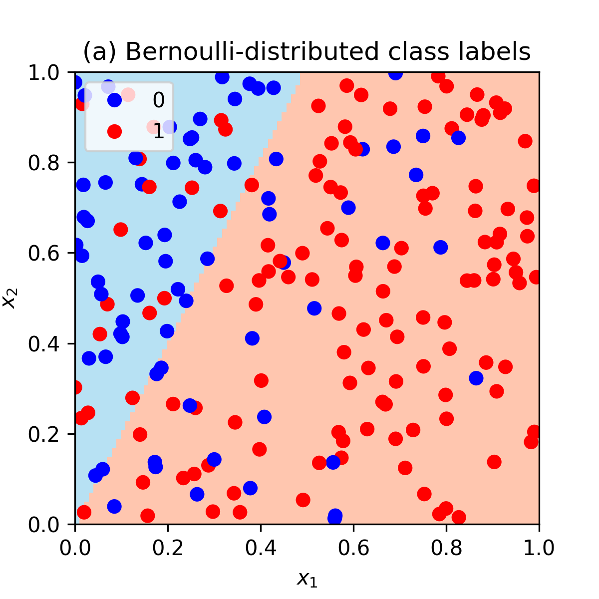
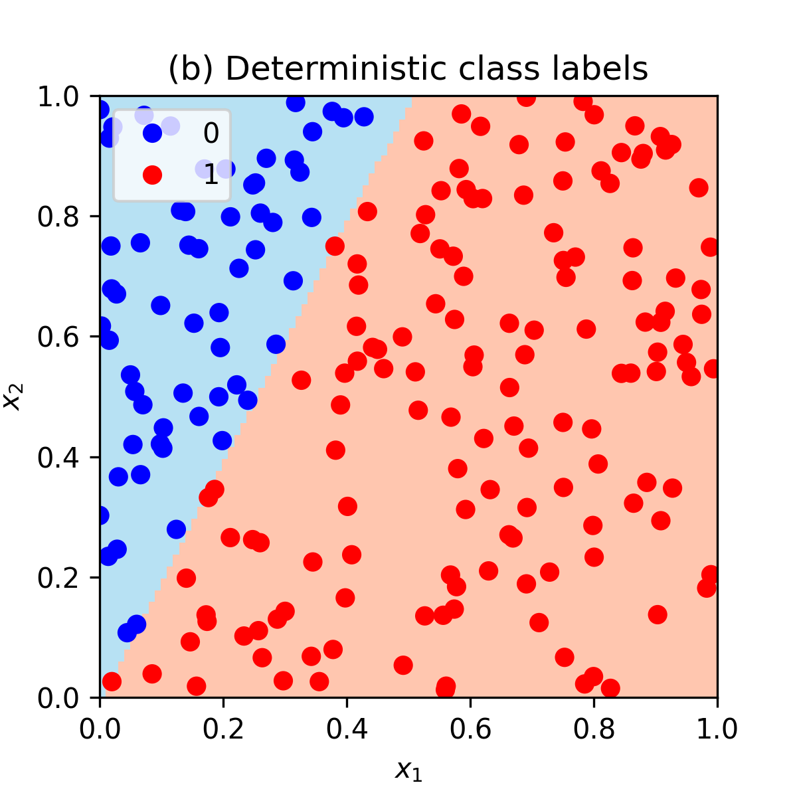

Generating data allows the true values of (usually) unknown variables to be set. And knowing the true values of these variables can be useful in experiments, for example, to check if a model is able to learn them. In this post we generate data for a binary logistic regression and discuss the source of randomness in it.

Let's start with something simpler. When using a linear regression, we assume that the data was generated with $y_i=\boldsymbol\theta^\top \mathbf{x}_i+\epsilon_i$, where $\epsilon_i$ is an explicit noise term. Usually, it is assumed to be Normally distributed. This is a source of randomness in the linear regression model and that's why data points don't lie on a straight line.

What is the source of randomness in a binary logistic regression model? Recall that logistic regression is a classification model where a conditional probability for the positive class (labeled as $1$) is

$$p(y = 1 | \mathbf{x}; \boldsymbol\theta) = \text{logistic}(\boldsymbol\theta^\top\mathbf{x}) = \frac{1}{1 + e^{-\boldsymbol\theta^\top\mathbf{x}}},$$

where $y$ is a class label, $\boldsymbol\theta$ is a vector of model parameters and $\mathbf{x}$ is a vector of features. The dot product $\boldsymbol\theta^\top\mathbf{x}$ is usually referred to as a logit.

Since there are only two classes, the conditional probability for the negative class (labeled as $0$) is

$$p(y = 0 | \mathbf{x}; \boldsymbol\theta) = 1 - p(y = 1 | \mathbf{x}; \boldsymbol\theta).$$

Notice that there is no explicit noise term here, e.g. $\epsilon$. The randomness in logistic regression setting originates from that fact that the class labels of data points follow Bernoulli distribution. Why Bernoulli? Because there are only two classes. And the parameter of the distribution is set according to the assumption of logistic regression about class probabilities. Therefore, the probability of a data point being of a positive class is $\text{Bernoulli}(p(y = 1 | \mathbf{x}; \boldsymbol\theta))$. 

Let's use this to generate a dataset for logistic regression. The following example uses Python.

```{python eval=FALSE}
import numpy as np
from sklearn.linear_model import LogisticRegression
```

Define a logistic function to model a probability of a positive class.

```{python eval=FALSE}
def logistic(z):
    return 1 / (1 + np.exp(-z))
```

Define the true values for the parameter vector $\boldsymbol\theta$ of length $p=2$.

```{python eval=FALSE}
# True theta coefficients.
theta = np.array([[4], [-2]])
# Number of features.
p = len(theta)
```

Generate $n=200$ data points from a uniform distribution on [0,1]. Note that logistic regression does not make an assumption about the distribution of $\mathbf{x}$ features. This is in contrast with, for example, linear and quadratic discriminant analysis.

```{python eval=FALSE}
# Number of training data points.
n = 200
# Generate feature values from U[0,1].
np.random.seed(1)
X = np.random.rand(n, p)
```

Calculate the probabilities of the positive class (labeled as $1$).

```{python eval=FALSE}
# Calculate logits.
z = np.dot(X, theta)
# Calculate probabilities.
prob = logistic(z)
```

The first five elements of the probability vector `prob` are $[0.56, 0.35, 0.60, 0.51, 0.62]$

Generate class labels from Bernoulli. Each data point uses its own probability from `prob`.

```{python eval=FALSE}
# Generate labels by sampling from Bernoulli(prob)
y = np.random.binomial(1, prob.flatten())
```

The first five class labels in `y` are $[0, 1, 1, 0, 1]$. Note how $\text{Bernoulli}(0.56)$ resulted into `0` and $\text{Bernoulli}(0.35)$ resulted into `1` due to a class label being a random variable.

Also note that we don't use some threshold, e.g. 0.5, to assign data points to classes deterministically! For example, we could label a data point with class $1$ when `prob` is above 0.5 and class 0 otherwise. But this would create a dataset with no noise (no randomness) where classes would be perfectly separable with a straight line. See an illustration at the bottom of the page.

Now train a logistic regression model with no intercept and no regularization to see if we are able to learn $\boldsymbol\theta$ parameters.

```{python eval=FALSE}
# Train a logistic regression model.
model = LogisticRegression(fit_intercept = False, penalty = "none").fit(X, y)
```

With the random seed set above, the learned $\boldsymbol\theta$ is $[3.94, -1.93]$, which is close to the true vector $[4, -2]$.

Here is a full code:

<script src="https://gist.github.com/dmitrijsk/69de066902d57bb4820bdc254313d1aa.js"></script>

Additionally, we can make an illustration of our simulated noisy dataset and the learned decision boundary of the logistic regression model:

<center>
{width=60%}
</center>

As noted above, if we would assign class labels deterministically with 

```{python eval=FALSE}
y_deterministic = np.where(prob.flatten() >= 0.5, 1, 0)
```

then the noiseless dataset with perfectly separable classes would look as follows:

<center>
{width=60%}
</center>

Full code, including plotting, is available [here](https://github.com/dmitrijsk/blogdown-dmitrijskass/blob/noise-term-in-logistic-regression/content/post/2021-11-20-the-noise-term-logistic-regression/code).

<hr>

I would appreciate any comments or suggestions. Please leave them below, no login required if you check "I'd rather post as a guest".
